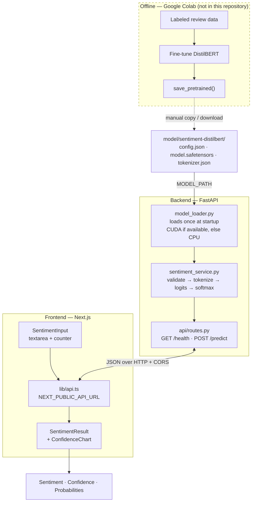
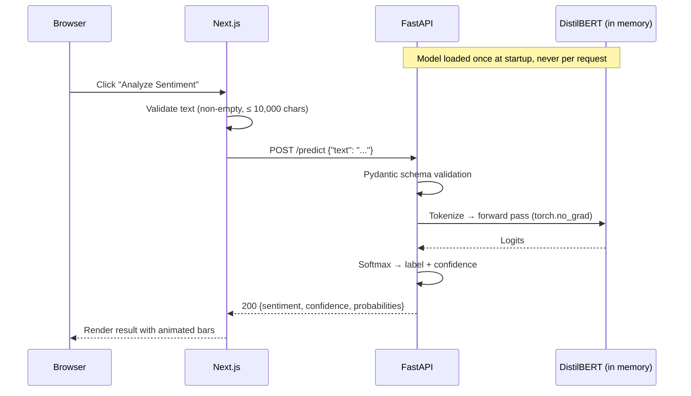
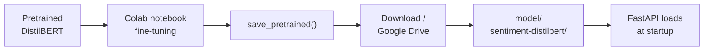

# AI Sentiment Classifier

A full-stack NLP application that uses a fine-tuned DistilBERT model to
classify text as **positive** or **negative**.

The model is fine-tuned offline in Google Colab and exported; this repository
serves it. A FastAPI backend loads the checkpoint once at startup and runs
inference, and a Next.js frontend provides the interface. **Nothing here
trains a model or downloads one from the internet.**

```
Google Colab → Fine-tuned DistilBERT → Exported Model
             → FastAPI → Next.js → Sentiment Prediction
```

---

## Table of contents

1. [Project overview](#1-project-overview)
2. [Architecture](#2-architecture)
3. [Features](#3-features)
4. [Tech stack](#4-tech-stack)
5. [Model information](#5-model-information)
6. [How the model was obtained](#6-how-the-model-was-obtained)
7. [Model installation](#7-model-installation)
8. [Backend setup](#8-backend-setup)
9. [Frontend setup](#9-frontend-setup)
10. [Environment variables](#10-environment-variables)
11. [API documentation](#11-api-documentation)
12. [Example request](#12-example-request)
13. [Example response](#13-example-response)
14. [Docker setup](#14-docker-setup)
15. [Testing](#15-testing)
16. [Future improvements](#16-future-improvements)

---

## 1. Project overview

This project takes a sentiment classifier that was fine-tuned externally and
turns it into a usable product: a REST API and a web interface.

The separation is deliberate. Training is expensive, occasional, and belongs in
a notebook with a GPU. Serving is cheap, constant, and belongs in a versioned
application. This repository is only the second half.

**What it does**

- Accepts a piece of text — a review, a comment, any prose.
- Runs it through the fine-tuned DistilBERT classifier.
- Returns the predicted label, the model's confidence, and the full probability
  distribution over both classes.

**What it deliberately does not do**

- No training loop, no dataset handling, no Hugging Face `Trainer`.
- No model downloads. The loader runs with `local_files_only=True` and the
  Docker image sets `HF_HUB_OFFLINE=1`, so a missing checkpoint fails loudly
  instead of silently fetching a different model.
- No modification of the checkpoint. The weights are read-only inputs, mounted
  `:ro` in Docker.

---

## 2. Architecture



### Request lifecycle



### Layering

Each concern lives in one place, and inference never happens inside a route.

```
backend/app/
├── main.py                     app assembly, CORS, lifespan (loads model once)
├── config.py                   settings — MODEL_PATH, CORS_ORIGINS
├── schemas.py                  request/response contracts
├── errors.py                   structured error codes and handlers
├── api/routes.py               HTTP only — validate, delegate, shape response
├── models/model_loader.py      loads the checkpoint; no inference logic
└── services/sentiment_service.py   the inference pipeline; no FastAPI imports

frontend/
├── app/page.tsx                layout only — header, subtitle, footer
├── lib/api.ts                  predictSentiment() → POST /predict
├── lib/types.ts                PredictionRequest / PredictionResponse / Probabilities
├── lib/constants.ts            API_BASE_URL — the only place the URL is read
└── components/
    ├── SentimentAnalyzer.tsx   owns idle → loading → success | error
    ├── SentimentInput.tsx      textarea, character counter, actions
    ├── SentimentResult.tsx     sentiment + confidence tiles
    ├── ConfidenceChart.tsx     per-class probability bars
    ├── ExampleReviews.tsx      one-click sample texts
    ├── LoadingState.tsx        skeleton while analyzing
    └── ErrorState.tsx          inline failure panel
```

---

## 3. Features

**Inference**

- Fine-tuned DistilBERT served locally — no third-party inference API.
- Model loaded **once** at application startup, not per request.
- Automatic device selection: CUDA when available, CPU otherwise.
- Runs in `eval()` mode under `torch.no_grad()`, so weights are never touched.
- Label names read from the checkpoint's `id2label`, not assumed from index
  order — a checkpoint that maps `0 → positive` would still be read correctly.
- Startup refuses to serve if the checkpoint's labels are not the expected pair.

**API**

- Typed request/response contracts with Pydantic v2.
- Structured errors: every failure returns `{"error": {"code", "message"}}`.
- Internal details (paths, stack traces, CUDA messages) are logged, never
  returned to clients.
- Interactive OpenAPI docs at `/docs`.
- CORS configured for the frontend origin.

**Frontend**

- Large textarea with a live character counter and ⌘/Ctrl+Enter to submit.
- Distinct idle, loading, success, and error states.
- Confidence bars built from two `div`s and a CSS transition — no charting
  library.
- Colour palette validated for colour-blind separation and 3:1 contrast in
  both light and dark themes.
- Responsive down to 390px; automatic light/dark theme; honours
  `prefers-reduced-motion`.

**Operations**

- Clear, actionable startup errors for a missing directory, missing tokenizer
  files, missing weights, or an invalid config.
- Container healthcheck that only passes once the model has finished loading.
- Both images run as non-root users.

---

## 4. Tech stack

| Layer | Technology | Version used here |
|-------|------------|-------------------|
| Model | DistilBERT (`DistilBertForSequenceClassification`) | 6-layer, 768-dim |
| ML runtime | PyTorch | 2.13.0 |
| ML tooling | Hugging Face Transformers | 5.15.0 |
| API | FastAPI | 0.141.1 |
| Validation | Pydantic + pydantic-settings | 2.13.4 |
| ASGI server | Uvicorn | 0.52.3 |
| Language | Python | 3.13 (3.11 in Docker) |
| Frontend | Next.js (App Router) | 16.3.1 |
| UI runtime | React | 19.2.8 |
| Styling | Tailwind CSS | 4.3.3 |
| Language | TypeScript | 5.9.3 |
| Tests | pytest | 9.1.1 |
| Packaging | Docker + Docker Compose | — |

Version floors are declared in `backend/requirements.txt` and
`frontend/package.json`; the table records the versions this project was
developed and verified against.

---

## 5. Model information

| Property | Value |
|----------|-------|
| Base architecture | DistilBERT (`distilbert-base-uncased` family) |
| Head | `DistilBertForSequenceClassification` |
| Task | Binary sequence classification |
| Labels | `0 → negative`, `1 → positive` |
| Transformer layers | 6 |
| Hidden size | 768 |
| Attention heads | 12 |
| Vocabulary | 30,522 (WordPiece, uncased) |
| Max sequence length | 512 tokens (longer input is truncated) |
| Weights file | `model.safetensors` (~256 MB, float32) |

The label mapping is read from the checkpoint's `config.json` at load time and
verified against the expected pair. If a checkpoint declares anything else, the
application refuses to start rather than serve mislabeled predictions.

### A note on performance metrics

**No accuracy, F1, or other evaluation metrics are published here.** The
checkpoint in this repository ships `config.json`, the weights, the tokenizer,
and `training_args.bin` — it contains no evaluation results, and this project
does not evaluate the model.

If you have metrics from the Colab evaluation run, add them here with the
dataset and split they were measured on. Do not quote numbers from the
published DistilBERT literature: those describe a different fine-tune on a
different dataset and say nothing about this checkpoint.

---

## 6. How the model was obtained

The classifier was fine-tuned **externally, in Google Colab**, from a
pretrained DistilBERT checkpoint. The training notebook is not part of this
repository, and none of that pipeline runs here.



The boundary is intentional: this repository consumes a finished artifact. It
has no training dependencies, no dataset, and no GPU requirement.

---

## 7. Model installation

The checkpoint is **not committed to git** — `model.safetensors` alone is
~256 MB. A fresh clone therefore has no weights, and the backend will refuse to
start until you supply them.

Extract your Colab export into:

```
model/sentiment-distilbert/
```

Expected contents:

| File | Required | Purpose |
|------|----------|---------|
| `config.json` | yes | Architecture and the `id2label` mapping |
| `model.safetensors` *(or `pytorch_model.bin`)* | yes | Trained weights |
| `tokenizer.json` *(or `vocab.txt`)* | yes | Tokenizer vocabulary |
| `tokenizer_config.json` | recommended | Tokenizer settings |
| `training_args.bin` | no | Colab training arguments; unused at inference |

Verify the placement:

```bash
ls model/sentiment-distilbert/
# config.json  model.safetensors  tokenizer.json  tokenizer_config.json
```

If the checkpoint is missing, startup fails with an actionable message rather
than a stack trace:

```
ModelLoadError: Model directory not found: /…/model/sentiment-distilbert.
Copy the fine-tuned checkpoint exported from Colab into that directory,
or point MODEL_PATH at its location.
```

See [model/README.md](model/README.md) for the full contract.

---

## 8. Backend setup

Requires Python 3.11+.

```bash
cd backend

python -m venv .venv
source .venv/bin/activate          # Windows: .venv\Scripts\activate

pip install -r requirements.txt

cp .env.example .env               # optional — all values have defaults

uvicorn app.main:app --reload --host 0.0.0.0 --port 8000
```

- API: `http://localhost:8000`
- Interactive docs: `http://localhost:8000/docs`

A successful start logs the model load:

```
INFO  app.models.model_loader  Loading sentiment checkpoint from /…/model/sentiment-distilbert
INFO  app.models.model_loader  Sentiment model ready on cpu with labels {0: 'negative', 1: 'positive'}
INFO                           Application startup complete.
```

If those lines are absent, the model did not load and `/predict` will return
`503`.

---

## 9. Frontend setup

Requires Node.js 20.9+.

```bash
cd frontend

npm install

cp .env.local.example .env.local   # optional — defaults to http://localhost:8000

npm run dev
```

- UI: `http://localhost:3000`

For a production build:

```bash
npm run build
npm start
```

> `NEXT_PUBLIC_API_URL` is inlined into the JavaScript bundle at build time.
> Set it **before** `npm run build`; changing it afterwards has no effect until
> you rebuild.

---

## 10. Environment variables

### Backend — `backend/.env`

| Variable | Default | Description |
|----------|---------|-------------|
| `MODEL_PATH` | `model/sentiment-distilbert` | Checkpoint directory. Relative paths resolve against the repository root, so the API behaves identically wherever uvicorn is started from. Absolute paths are used as given. |
| `CORS_ORIGINS` | `["http://localhost:3000"]` | JSON array of allowed browser origins. |
| `APP_NAME` | `Sentiment Classifier API` | Title shown in the OpenAPI docs. |

### Frontend — `frontend/.env.local`

| Variable | Default | Description |
|----------|---------|-------------|
| `NEXT_PUBLIC_API_URL` | `http://localhost:8000` | Base URL of the backend. **Build-time**: inlined at compile time. This is the URL the *browser* calls, so it must be reachable from the browser — not a Docker service name. |

### Docker Compose only

| Variable | Default | Description |
|----------|---------|-------------|
| `BACKEND_PORT` | `8000` | Published API port on the host. |
| `FRONTEND_PORT` | `3000` | Published UI port on the host. |
| `TORCH_INDEX_URL` | PyTorch CPU wheel index | **Build-time**. Set to `https://pypi.org/simple` to build a CUDA-capable image. |

The API URL is read in exactly one place — `API_BASE_URL` in
`frontend/lib/constants.ts`. No component hardcodes it.

---

## 11. API documentation

Base URL: `http://localhost:8000` · Interactive docs: `/docs` · Schema: `/openapi.json`

### `GET /health`

Liveness probe. Does not depend on the model, so it answers even if the
checkpoint failed to load.

```json
{ "status": "ok" }
```

### `POST /predict`

Classifies a single text.

**Request body**

| Field | Type | Constraints |
|-------|------|-------------|
| `text` | string | Required. Non-empty after trimming; 1–10,000 characters. Input longer than 512 tokens is truncated by the tokenizer, not rejected. |

**Response body** — `200 OK`

| Field | Type | Description |
|-------|------|-------------|
| `text` | string | The submitted text, echoed verbatim |
| `sentiment` | `"positive"` \| `"negative"` | The higher-probability class |
| `confidence` | float | Probability of the predicted class, `0.0`–`1.0` |
| `probabilities` | object | Probability per class; the two values sum to 1 |

**Errors**

Every error returns the same envelope, with no internal detail:

```json
{ "error": { "code": "EMPTY_TEXT", "message": "Text must not be empty." } }
```

| Status | Code | When |
|--------|------|------|
| 422 | `EMPTY_TEXT` | Text is empty or whitespace only |
| 422 | `TEXT_TOO_LONG` | Text exceeds 10,000 characters |
| 422 | `INVALID_REQUEST` | Missing field, wrong type, or malformed JSON |
| 500 | `INFERENCE_FAILURE` | The forward pass failed |
| 500 | `INTERNAL_ERROR` | Anything unanticipated |
| 503 | `MODEL_NOT_FOUND` / `MODEL_LOAD_FAILURE` / `TOKENIZER_FAILURE` | The model is unavailable |

---

## 12. Example request

```bash
curl -X POST http://localhost:8000/predict \
  -H 'Content-Type: application/json' \
  -d '{"text": "I really enjoyed this movie."}'
```

JavaScript:

```ts
const response = await fetch(`${process.env.NEXT_PUBLIC_API_URL}/predict`, {
  method: "POST",
  headers: { "Content-Type": "application/json" },
  body: JSON.stringify({ text: "I really enjoyed this movie." }),
});
const prediction = await response.json();
```

Python:

```python
import httpx

prediction = httpx.post(
    "http://localhost:8000/predict",
    json={"text": "I really enjoyed this movie."},
).json()
```

---

## 13. Example response

```json
{
  "text": "I really enjoyed this movie.",
  "sentiment": "positive",
  "confidence": 0.9971,
  "probabilities": {
    "positive": 0.9971,
    "negative": 0.0029
  }
}
```

A negative example:

```json
{
  "text": "This was a boring, terrible waste of time.",
  "sentiment": "negative",
  "confidence": 0.9981,
  "probabilities": {
    "positive": 0.0019,
    "negative": 0.9981
  }
}
```

Probabilities are rounded to four decimal places. `confidence` always equals
`probabilities[sentiment]`. These are real responses from the checkpoint in
this repository; they are illustrative of the API shape, not a claim about
accuracy on any benchmark.

---

## 14. Docker setup

Both images are production images: uvicorn without `--reload`, and Next's
production server rather than the dev server.

**The model is never baked into an image and never downloaded.** It is mounted
read-only from `./model/sentiment-distilbert`, so the checkpoint must exist on
the host first.

```bash
docker compose up --build
```

- UI: `http://localhost:3000`
- API: `http://localhost:8000`

The frontend waits for the backend healthcheck, which only passes once the
model has loaded.

### Common commands

```bash
docker compose up -d --build     # start in the background
docker compose logs -f backend   # follow API logs (model load appears here)
docker compose ps                # container + health status
docker compose down              # stop and remove containers
docker compose build --no-cache  # force a clean rebuild
```

Building images directly:

```bash
docker build -t sentiment-backend ./backend
docker build -t sentiment-frontend \
  --build-arg NEXT_PUBLIC_API_URL=http://localhost:8000 ./frontend

docker run --rm -p 8000:8000 \
  -v "$PWD/model/sentiment-distilbert:/model/sentiment-distilbert:ro" \
  -e MODEL_PATH=/model/sentiment-distilbert \
  sentiment-backend
```

### GPU images

The backend image installs the **CPU-only** PyTorch wheel by default, which
keeps it several gigabytes smaller. For GPU inference, rebuild against PyPI and
give the container a GPU:

```bash
TORCH_INDEX_URL=https://pypi.org/simple docker compose build backend
```

### Troubleshooting

| Symptom | Cause |
|---------|-------|
| Backend exits with `Model directory not found` | `model/sentiment-distilbert/` is empty on the host |
| Frontend loads but every analysis errors | `NEXT_PUBLIC_API_URL` was baked with the wrong host — rebuild the frontend |
| Browser console shows a CORS error | Add the UI origin to `CORS_ORIGINS` |
| `frontend` never starts | It waits on the backend healthcheck — check `docker compose logs backend` |

---

## 15. Testing

```bash
cd backend
pip install -r requirements-dev.txt

pytest                  # fast suite — fake model, no weights loaded
pytest -m integration   # runs the real checkpoint from MODEL_PATH
pytest -v               # verbose
```

The default suite **never loads, trains, or downloads a model**. `tests/conftest.py`
supplies a fake tokenizer and classifier whose tensors flow through the real
service code, and the FastAPI dependency is swapped via
`app.dependency_overrides`. `HF_HUB_OFFLINE` is forced on, so even a mistaken
test cannot reach the Hugging Face Hub. The suite runs in well under a second —
which is itself the evidence that no weights are being loaded.

| File | Covers |
|------|--------|
| `test_health.py` | `GET /health` |
| `test_predict.py` | Positive and negative predictions; probability invariants |
| `test_validation.py` | Empty, whitespace, over-length, missing, wrong-type, malformed JSON |
| `test_schemas.py` | Schema contracts independent of HTTP |
| `test_sentiment_service.py` | Pipeline units — eval mode, no-grad, label mapping, batching |
| `test_api_errors.py` | 503 / 500 paths, no internal leakage, CORS |
| `test_integration_real_model.py` | The real checkpoint — skipped when absent |

Integration tests are deselected by default (`pytest.ini`) and skip themselves
when no checkpoint is present, so a clone without weights never fails for that
reason alone.

Frontend checks:

```bash
cd frontend
npx tsc --noEmit    # type check
npm run build       # production build
```

---

## 16. Future improvements

**Model**

- Publish evaluation metrics (accuracy, F1, confusion matrix) from the Colab
  run, with the dataset and split stated.
- Add a neutral class, or a confidence threshold below which the result is
  reported as uncertain — binary classifiers are overconfident on ambiguous
  text.
- Calibration (temperature scaling) so `confidence` reflects real likelihood.
- Track checkpoint versions so a prediction can be traced to the model that
  produced it.

**Backend**

- Batch endpoint (`POST /predict/batch`) for classifying many texts per call.
- Rate limiting and request-size limits ahead of any public deployment.
- Structured JSON logging with request ids.
- Prometheus metrics: latency histogram, request counts, error rates.
- ONNX Runtime or `torch.compile` for lower CPU latency.
- Token-level attribution to show which words drove the prediction.

**Frontend**

- History of recent analyses within the session.
- Batch input — one text per line, results in a table.
- Copy-as-JSON and CSV export.
- An explicit light/dark toggle rather than following the OS only.
- Component tests for the state machine.

**Operations**

- CI running the backend suite, the type check, and the production build on
  every push.
- Pinned dependency versions (lockfile) for reproducible images.
- Model artifact storage (S3, GCS, or Git LFS) so deployments fetch a versioned
  checkpoint instead of relying on a manual copy.
- End-to-end smoke test against a running stack.

---

## Project structure

```
sentiment-classifier/
├── backend/                    FastAPI inference API
│   ├── app/                    application code
│   ├── tests/                  pytest suite
│   ├── Dockerfile
│   ├── requirements.txt
│   └── .env.example
├── frontend/                   Next.js UI
│   ├── app/                    App Router pages
│   ├── components/             UI components
│   ├── lib/                    API client, types, constants
│   ├── Dockerfile
│   └── .env.local.example
├── model/
│   ├── README.md               checkpoint contract
│   └── sentiment-distilbert/   the fine-tuned model (not in git)
├── docker-compose.yml
└── README.md
```

## License

No license has been declared for this repository. The fine-tuned checkpoint
inherits the licensing of its base model and training data — confirm both
before any public or commercial deployment.
